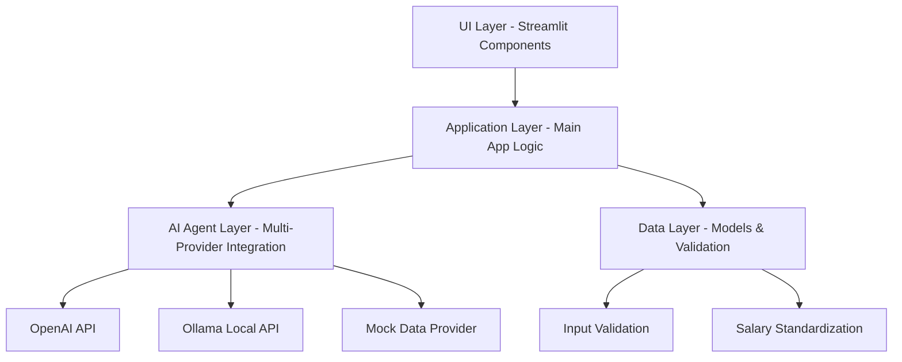

# Design Document: Career Comparison Tool

## Overview

The Career Referee is a Streamlit-based web application that provides AI-powered career comparisons. The system follows a clean architecture with separated concerns: UI components handle user interaction, AI agents manage external API calls with fallback strategies, and data models ensure type safety and validation.

The application prioritizes cost efficiency by preferring free local AI (Ollama) over paid services (OpenAI), with intelligent fallback to mock data. All salary information is standardized to low/medium/high categories for consistent comparison.

## Architecture

The system follows a layered architecture pattern:



**Key Architectural Decisions:**
- **Separation of Concerns**: UI, business logic, AI integration, and data models are cleanly separated
- **Provider Abstraction**: AI providers are abstracted behind a common interface with automatic fallback
- **Stateless Design**: Each comparison is independent, with minimal session state
- **Cost Optimization**: Free providers are prioritized, with optimized prompts for paid services

## Components and Interfaces

### Main Application (app.py)
- **Purpose**: Entry point and page routing
- **Key Functions**:
  - `main()`: Application initialization and routing
  - `render_input_page_handler()`: Handles input form submission and AI analysis
  - `render_comparison_page_handler()`: Manages comparison page display
- **Dependencies**: UI components, AI agent, session state management

### UI Components (ui.py)
- **Purpose**: Streamlit-based user interface components
- **Key Functions**:
  - `render_input_page()`: Input form with validation
  - `render_comparison_page()`: Side-by-side career comparison display
  - `render_career_card()`: Individual career information card
  - `render_decision_guide()`: Decision guidance section
  - `apply_custom_styling()`: CSS injection for modern UI
- **Dependencies**: Models for validation, custom CSS styling

### AI Agent (referee_agent.py)
- **Purpose**: Multi-provider AI integration with fallback strategy
- **Key Functions**:
  - `run_referee()`: Main comparison orchestration with provider fallback
  - `_call_ollama_api()`: Local Ollama API integration
  - `_call_openai_api()`: OpenAI API with retry logic
  - `_parse_ai_response()`: JSON parsing and validation
  - `_standardize_salary_format()`: Salary standardization
- **Provider Priority**: Ollama → OpenAI → Mock Data
- **Dependencies**: OpenAI SDK, requests library, data models

### Data Models (models.py)
- **Purpose**: Type-safe data structures and validation
- **Key Classes**:
  - `CareerInfo`: Individual career data structure
  - `ComparisonResult`: Complete comparison result container
- **Key Functions**:
  - `validate_career_input()`: Career name validation
  - `validate_user_name()`: User name validation
  - `validate_standardized_salary()`: Salary format validation
- **Dependencies**: Python dataclasses, typing

## Data Models

### CareerInfo
```python
@dataclass
class CareerInfo:
    overview: str          # 2-line career summary
    skills: str           # Required skills description
    salary: str           # Standardized: "low"/"medium"/"high"
    time_to_enter: str    # Time to become job-ready
    pros: List[str]       # Exactly 3 advantages
    cons: List[str]       # Exactly 3 disadvantages
```

**Validation Rules:**
- `pros` and `cons` must contain exactly 3 items each
- `salary` must be standardized to low/medium/high format
- All string fields must be non-empty

### ComparisonResult
```python
@dataclass
class ComparisonResult:
    career_a: CareerInfo      # First career analysis
    career_b: CareerInfo      # Second career analysis
    decision_guide: List[str] # At least 2 guidance statements
```

**Validation Rules:**
- `decision_guide` must contain at least 2 items
- Both `career_a` and `career_b` must be valid CareerInfo objects
- Supports JSON serialization via `to_dict()` and `from_dict()` methods

### Input Validation
- **Career Names**: 1-100 characters, non-empty, non-whitespace
- **User Names**: 1-50 characters, non-empty, non-whitespace
- **Salary Standardization**: Converts various formats to low/medium/high using regex patterns

### AI Response Format
The system expects AI providers to return JSON in this structure:
```json
{
  "career_a": {
    "overview": "2-line summary",
    "skills": "required skills",
    "salary": "low/medium/high",
    "time_to_enter": "time needed",
    "pros": ["advantage1", "advantage2", "advantage3"],
    "cons": ["disadvantage1", "disadvantage2", "disadvantage3"]
  },
  "career_b": { /* same structure */ },
  "decision_guide": [
    "Choose career_a if...",
    "Choose career_b if..."
  ]
}
```

## Correctness Properties

*A property is a characteristic or behavior that should hold true across all valid executions of a system-essentially, a formal statement about what the system should do. Properties serve as the bridge between human-readable specifications and machine-verifiable correctness guarantees.*

### Property 1: Input Validation Consistency
*For any* user input (name or career), if the input exceeds length limits (50 chars for names, 100 chars for careers) or contains only whitespace, the validation should reject it consistently
**Validates: Requirements 1.3, 1.5, 1.6**

### Property 2: Valid Input Processing
*For any* valid user inputs (name and two different careers), the system should store the inputs and proceed to analysis without errors
**Validates: Requirements 1.2**

### Property 3: AI Provider Fallback Chain
*For any* career comparison request, the system should attempt providers in the correct order (Ollama → OpenAI → Mock) and successfully return a comparison result
**Validates: Requirements 2.2, 2.3**

### Property 4: AI Response Structure Validation
*For any* AI-generated response, the system should ensure it contains all required fields (overview, skills, salary, timeline, exactly 3 pros, exactly 3 cons, at least 2 decision guide items)
**Validates: Requirements 2.1, 2.5, 2.6**

### Property 5: Salary Standardization Consistency
*For any* salary input format (numeric ranges, descriptive terms, or unclear data), the standardizer should consistently map it to exactly one of "low", "medium", or "high" categories
**Validates: Requirements 3.1, 3.2, 3.3, 3.4, 3.5**

### Property 6: UI Display Completeness
*For any* career comparison data, the UI should display all required information fields (overview, skills, salary, timeline, pros, cons) in the rendered output
**Validates: Requirements 4.1, 4.2**

### Property 7: UI Formatting Consistency
*For any* career display, the UI should consistently apply appropriate emoji formatting (💰 for salary, ⏱️ for timeline, ✅ for pros, ⚠️ for cons)
**Validates: Requirements 4.3, 4.4, 4.5, 4.6**

### Property 8: Decision Guide Personalization
*For any* user name and comparison result, the decision guidance should include the user's name in the personalized header
**Validates: Requirements 5.4**

### Property 9: Response Validation and Fallback
*For any* invalid AI response (missing fields, wrong data types, invalid structure), the system should reject it and provide fallback data with appropriate error messaging
**Validates: Requirements 7.2, 7.4, 7.5, 7.6**

### Property 10: JSON Parsing Robustness
*For any* AI response containing markdown formatting or JSON syntax issues, the parser should clean and extract valid JSON before processing
**Validates: Requirements 7.1, 7.3**

### Property 11: Session State Management
*For any* navigation action (submit → comparison, back → input), the system should correctly manage session state (store on submit, clear on back, redirect when missing)
**Validates: Requirements 8.2, 8.4, 8.5, 8.6**

### Property 12: OpenAI Retry Logic
*For any* OpenAI API failure, the system should implement exponential backoff retry logic up to the maximum retry limit
**Validates: Requirements 6.4**

### Property 13: Ollama Model Fallback
*For any* Ollama usage, the system should try models in preference order and fallback to the next model on failure
**Validates: Requirements 6.5**

## Error Handling

The system implements comprehensive error handling at multiple levels:

### Input Validation Errors
- **Empty/Whitespace Inputs**: Display user-friendly validation messages
- **Length Limit Violations**: Prevent submission with clear error feedback
- **Identical Career Options**: Reject with specific guidance to enter different careers

### AI Provider Errors
- **Network Failures**: Automatic fallback to next provider in chain
- **API Rate Limits**: Exponential backoff retry for OpenAI
- **Invalid Responses**: JSON parsing with cleanup and validation
- **Missing Fields**: Structured validation with specific error messages

### Data Processing Errors
- **Salary Standardization**: Graceful handling of unknown formats with default to "medium"
- **Response Structure**: Validation of required fields with fallback to mock data
- **Session Management**: Automatic redirect to input page when session data is corrupted

### UI Error Handling
- **Missing Data**: Graceful degradation with placeholder content
- **Rendering Failures**: Fallback to basic text display
- **Navigation Errors**: Automatic state recovery and page redirection

## Testing Strategy

The testing approach combines unit tests for specific examples and property-based tests for universal correctness validation.

### Unit Testing Focus
- **Specific Examples**: Test concrete scenarios like "Software Engineer vs Data Scientist"
- **Edge Cases**: Empty inputs, identical careers, network timeouts
- **Integration Points**: AI provider switching, session state transitions
- **Error Conditions**: Invalid JSON responses, missing API keys, network failures

### Property-Based Testing Focus
- **Input Validation**: Generate random inputs to test validation consistency
- **Salary Standardization**: Test various salary formats against standardization rules
- **AI Response Parsing**: Generate malformed JSON to test parsing robustness
- **UI Rendering**: Test display completeness across random career data
- **Provider Fallback**: Test fallback chain with simulated provider failures

### Testing Configuration
- **Minimum 100 iterations** per property test for comprehensive coverage
- **Property test tags**: Format: **Feature: career-comparison-tool, Property {number}: {property_text}**
- **Mock AI Responses**: Use controlled test data for consistent property validation
- **UI Testing**: Streamlit component testing with rendered output validation
- **Integration Testing**: End-to-end workflow testing with real AI provider fallback

### Test Data Generation
- **Smart Generators**: Create realistic career names, user names, and salary formats
- **Edge Case Coverage**: Include boundary conditions, empty strings, and malformed data
- **Realistic Scenarios**: Generate test cases that mirror actual user behavior
- **Error Simulation**: Controlled failure injection for testing error handling paths